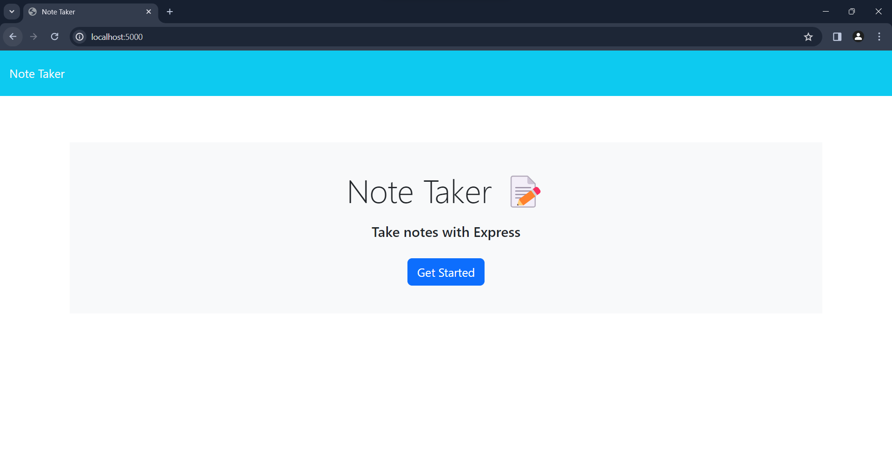
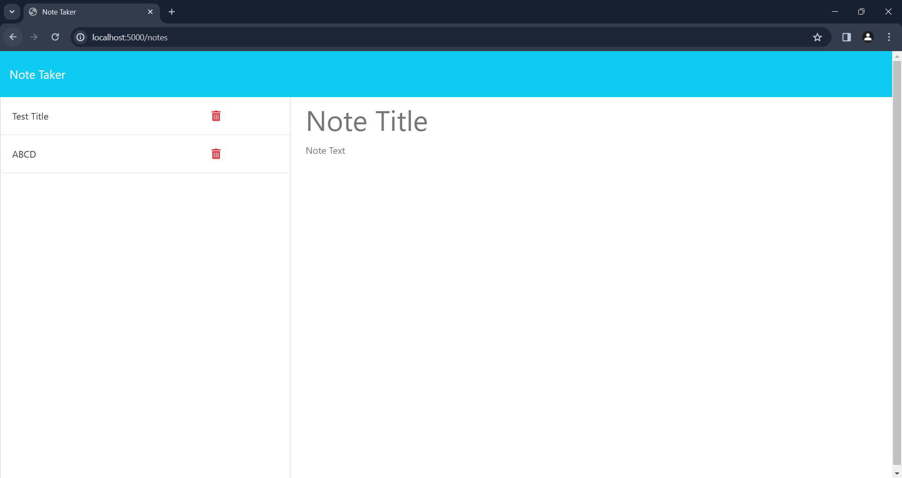

# Note Taker

This is a simple note-taking application built with Express.js on the backend. Users can write, save, and delete notes to help organize their thoughts and tasks.

## Table of Contents

- [Installation](#installation)
- [Usage](#usage)
- [API Routes](#api-routes)
- [Demo](#demo)
- [Deployed Application](#deployed-application)
- [Technologies Used](#technologies-used)

## Installation

To run this application locally, follow these steps:

1. Clone the repository: `git clone https://github.com/your-username/your-repo.git`
2. Navigate to the project directory: `cd your-repo`
3. Install dependencies: `npm install`
4. Start the development server: `npm run dev`
5. Open your browser and go to `http://localhost:3000`

## Usage

- Open the application in your browser.
- Click on the "Get Started" button.
- Create new notes by entering a title and text, then click "Save Note."
- View existing notes in the left-hand column.
- Click on an existing note to view it or click "New Note" to start a new note.
- To delete a note, click the trash can icon next to the note in the left-hand column.

## API Routes

- **GET `/api/notes`**: Retrieve all saved notes.
- **POST `/api/notes`**: Save a new note to the server.
- **DELETE `/api/notes:id`**: delete the note to the server.

## Demo

| Landing Page | Note Page |
| ------------ | --------- |
|  |  |

## Deployed Application

The application is deployed on Heroku. You can access it [here](your-heroku-app-url).

## Technologies Used

- Express.js
- Node.js
- HTML
- CSS
- JavaScript